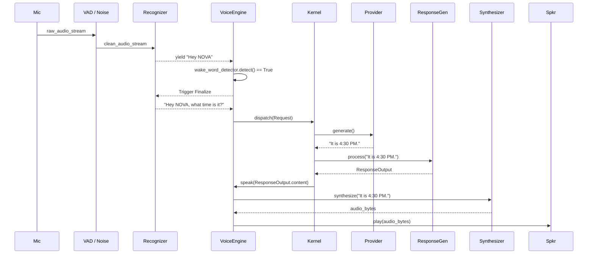
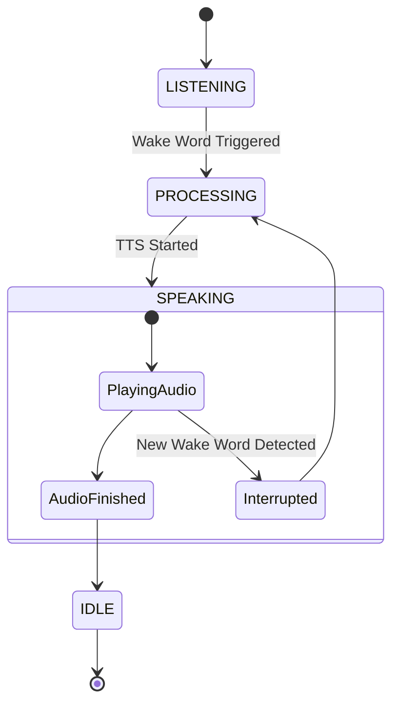

# NOVA Voice Pipeline Validation

This document illustrates the end-to-end traversal of audio data through the NOVA architecture, from raw hardware capture to LLM response synthesis.

## 1. End-to-End Voice Interaction Sequence


## 2. Audio Processing Pipeline
```mermaid
flowchart LR
    A[Microphone (PCM)] --> B[AudioBuffer]
    B --> C[Echo Canceller]
    C --> D[Noise Suppressor]
    D --> E{VAD Detect?}
    E -- No --> B
    E -- Yes --> F[Speech Recognizer]
```

## 3. Interruption State Machine (Barge-In)

