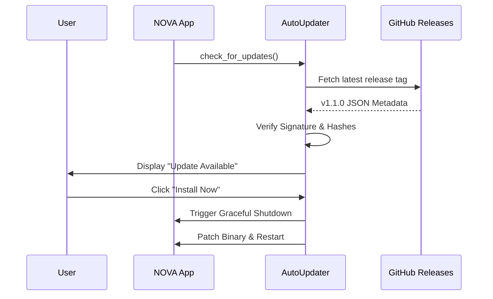

# NOVA Auto Update Flow

## 1. Sequence

```mermaid
sequenceDiagram
    participant User
    participant App as NOVA App
    participant Updater as AutoUpdater
    participant Server as GitHub Releases

    App->>Updater: check_for_updates()
    Updater->>Server: Fetch latest release tag
    Server-->>Updater: v1.1.0 JSON Metadata
    
    Updater->>Updater: Verify Signature & Hashes
    
    Updater->>User: Display "Update Available"
    User->>Updater: Click "Install Now"
    
    Updater->>App: Trigger Graceful Shutdown
    Updater->>App: Patch Binary & Restart
```
