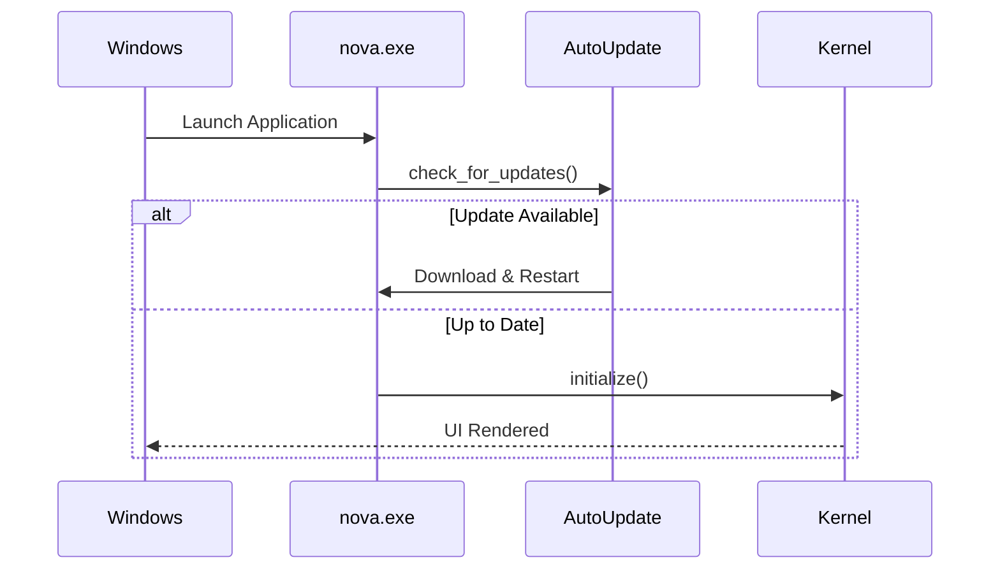

# NOVA Deployment Architecture

## 1. Overview
The NOVA deployment strategy focuses on entirely client-side, local execution. We do not host NOVA instances on cloud virtual machines; instead, the deployment package is shipped directly to the user's Windows machine.

## 2. Boot Sequence

## 3. Sandboxed Execution
During deployment, the `InstallerGenerator` ensures that the `nova.exe` process is explicitly granted permissions to bind to local ports (for internal IPC between the frontend and backend) but remains restricted from outbound network calls unless explicitly whitelisted in the `SettingsSystem` (e.g. for AI Provider APIs).
