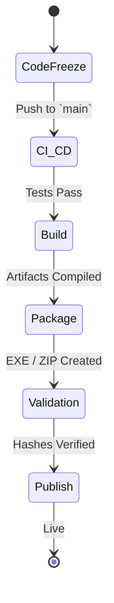

# NOVA Release Guide

## 1. Overview
The Release System is responsible for packaging the tested codebase into a final, user-distributable binary. It manages artifact generation, digital signing, and telemetry configurations for the live product.

## 2. Release Lifecycle

## 3. Package Types
1. **Windows Installer (`.exe` / `.msi`)**: Full installation with registry hooks, desktop shortcuts, and auto-start configurations.
2. **Portable Build (`.zip`)**: Standalone directory that stores configuration locally rather than in `AppData`, allowing execution from a USB drive.

## 4. Subsystem Components
- **BuildManager:** Orchestrates `PyInstaller` or `Nuitka` for bundling the Python backend.
- **PackageManager:** Wraps the bundled binaries in NSIS.
- **ArtifactManager:** Pushes the final hashes to GitHub Releases.
