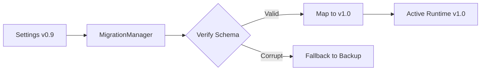

# NOVA Versioning Strategy

## 1. Semantic Versioning
We adhere strictly to SemVer 2.0.0 (`MAJOR.MINOR.PATCH`).
- **MAJOR:** Incompatible API changes to the Plugin System or underlying Memory Schema. Requires the `MigrationManager` to intervene.
- **MINOR:** Backwards-compatible features (e.g. adding a new AI Provider).
- **PATCH:** Backwards-compatible bug fixes (e.g. fixing a UI layout issue in the Chat System).

## 2. Migration Pipelines

