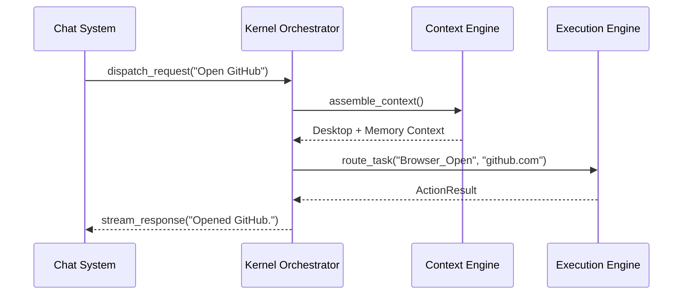

# NOVA Integration & E2E Validation

## 1. Overview
The `IntegrationTestRunner` validates that the heavily decoupled microservices within NOVA successfully communicate over the `EventBus` without dropped messages or deadlocks.

## 2. Core Workflow Verification
We explicitly test the boundary handoffs for the primary AI Engine pipeline:

## 3. Supported E2E Scenarios
The test suite physically executes these macro-level user commands to prove full-stack readiness:
- **"Open browser and search internet"**: Tests `BrowserEngine`, `SearchEngine`, and `ExecutionEngine` orchestration.
- **"Read email and reply"**: Tests `EmailAgent`, `ContextEngine`, and `MemoryEngine` (for historical reply context).
- **"Take a screenshot and summarize"**: Tests `DesktopEngine`, `VisionEngine`, and `ResponseGenerator`.
- **"Load plugin and switch profile"**: Tests `PluginSystem` sandboxing and `SettingsSystem` cache invalidation.

## 4. Failure Isolation
Because dependencies are strictly injected, if the "Read Email" integration test fails, the runner can deterministically isolate whether the failure originated in the `IMAPConnector` or the downstream `ContextAssembler`.
