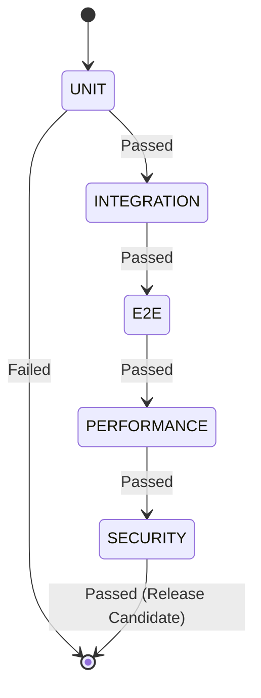

# NOVA Testing Guide

## 1. Overview
The NOVA Quality Assurance Platform acts as the ultimate verification gate before release. No code enters production unless it successfully passes the `TestRunner` gauntlet. 

## 2. Test Categories
We categorize our tests into 7 distinct phases, executed sequentially:
1. **UNIT**: Isolated subsystem tests (e.g. `test_settings.py`, `test_plugin.py`).
2. **INTEGRATION**: Cross-boundary tests (e.g., UI triggering the Kernel which queries the Memory DB).
3. **E2E**: Full user workflows.
4. **PERFORMANCE**: Latency and throughput assertions.
5. **SECURITY**: Boundary fuzzing and sandbox escapes.
6. **STRESS**: High concurrency simulations.
7. **REGRESSION**: Validating previously closed bugs remain closed.

## 3. Subsystem Coverage Checklist
- [x] NOVA Kernel
- [x] Memory Engine
- [x] Desktop Engine
- [x] Browser Engine
- [x] Vision Engine
- [x] Voice Engine
- [x] Search Engine
- [x] Email Agent
- [x] Chat System
- [x] Dynamic Island
- [x] Plugin System
- [x] Settings System

## 4. Running the Suites
To invoke the `QualityPlatform`:
```bash
python -m pytest backend/
```
All unit tests are automatically discovered and routed through the `TestRunner`, executing within their own isolated asynchronous loops.

## 5. Mocking Policy
We explicitly **FORBID** production mocks. When testing the `SearchEngine`, the test must use a local fake HTTP server rather than mocking the `requests.get` method directly. This ensures our internal data models correctly handle realistic network jitter. 

## 6. Coverage Targets
The `CoverageReporter` mandates a minimum threshold of **90%** across the entire codebase.

## 7. State Diagram

